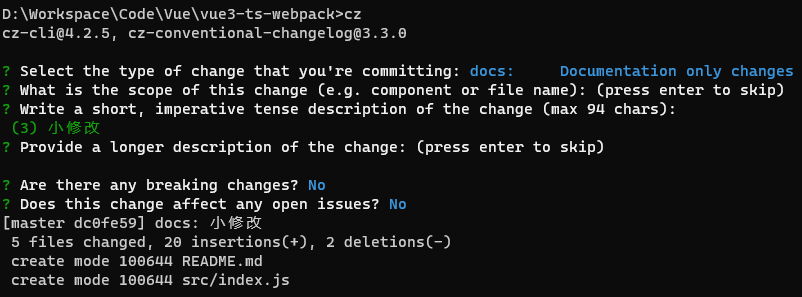

## 介绍

Commitizen是一款用来规范git commit message的工具。

Documentation: https://commitizen-tools.github.io/commitizen/

cz-cli: https://github.com/commitizen/cz-cli

## 全局安装

Install `commitizen` globally, if you have not already.

```shell
npm install -g commitizen
```

Install your preferred `commitizen` adapter globally (for example [`cz-conventional-changelog`](https://www.npmjs.com/package/cz-conventional-changelog)).

```shell
npm install -g cz-conventional-changelog
```

Create a `.czrc` file in your `home` directory, with `path` referring to the preferred, globally-installed, `commitizen` adapter

```shell
echo '{ "path": "cz-conventional-changelog" }' > C:\Users\feipe\.czrc
```

You are all set! Now `cd` into any `git` repository and use `git cz` instead of `git commit`, and you will find the `commitizen` prompt.

Pro tip: You can use all the `git commit` `options` with `git cz`. For example: `git cz -a`.

## 使用

```shell
git cz
# 简短命令
cz
```

初次使用实例如下：


