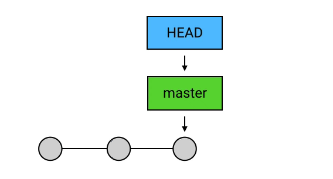

## 概念

### 工作区、暂存区、版本库

- 工作区（working tree）：当前正在处理的目录树，对本地仓库所在文件夹里除了`.git`目录之外的文件。
- 暂存区（index）：顾名思义就是暂存更改（想要commit的文件）的地方，对应`.git`目录中的`index`文件。当对工作区修改/新增的文件执行`git add`命令时，index文件被更新。
- 版本库：本地仓库中的`.git`目录，该仓库的所有版本信息都会存在这里面。

### HEAD

> 它是一个指向**当前commit**（当前工作目录所对应的commit）的引用，对应`.git`目录中的`HEAD`文件。

- HEAD通常是指向某个branch，从而间接指向commit的。当HEAD直接指向commit时，会进入`detached`（游离）状态，我们称之为`detached HEAD`。（使用`git checkout <commit id>`命令可以进入这种状态，`git checkout --detach`也可以让HEAD脱离branch指针，直接指向对应的commit）。

- 使用`commit`、`reset`命令改变当前commit的手，HEAD会跟着branch一起指向新的commit。

  

### Branch

> Branch指针也是指向commit的引用，对应`.git/refs/heads`目录中的文件，文件名与分支名相同

#### branch的通俗化理解

> 尽管在 Git 中，`branch` 只是一个指向 `commit` 的引用，但它有一个更通俗的理解：你还可以把一个 `branch` 理解为从初始 `commit` 到 `branch` 所指向的 `commit` 之间的所有 `commit`s 的一个「串」。 它包含了从初始 `commit` 到它的所有路径，而不是一条路径。

### 引用的本质

> 所谓「引用」（reference），其实就是一个个的字符串。这个字符串可以是一个 `commit` 的 SHA-1 码（例：`c08de9a4d8771144cd23986f9f76c4ed729e69b0`），也可以是一个 `branch`（例：`ref: refs/heads/feature3`）。
>
> Git 中的 `HEAD` 和每一个 `branch` 以及其他的引用，都是以文本文件的形式存储在本地仓库 `.git` 目录中，而 Git 在工作的时候，就是通过这些文本文件的内容来判断这些所谓的「引用」是指向谁的。

参考：

[Git-你好, HEAD 同学](https://drprincess.github.io/2018/02/27/Git-你好HEAD同学/)

[git 理解 Head指针&Branch指针--reset&checkout](https://blog.csdn.net/claroja/article/details/78858533)

