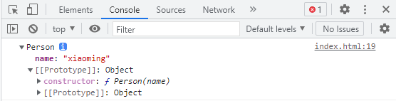
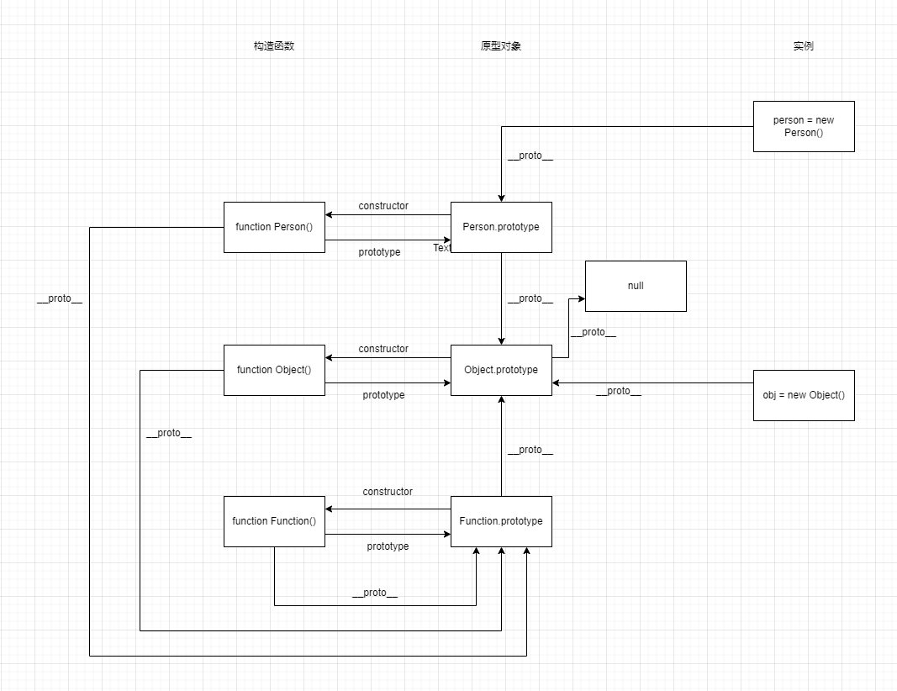

> JS面向对象的本质不是基于类(class)，而是基于构造函数(constructor)和原型对象(prototype)

# 创建对象（封装）
> 最简单的创建对象的方式就是通过**Object的构造函数**或者**对象字面量**，但这两种方式在使用同一个接口创建多个对象时会产生大量重复代码。


## 工厂模式
```javascript
function createPerson(name, age, job) {
  let o = new Object();
  o.name = name;
  o.age = age;
  o.job = job;
  o.sayName = function() {
    console.log(this.name);
  }
  return o;
}

let person = createPerson('zhangsan', 20, 'FrontEnd Engineer');
```

> 工厂模式解决了创建多个相似对象的问题，但没有解决对象识别的问题（即怎样知道一个对象的类型）。
    

## 构造函数模式
```javascript
function Person(name, age, job) {
  this.name = name;
  this.age = age;
  this.job = job;
  this.sayName = function() {
    console.log(this.name);
  }
}

let person = new Person('zhangsan', 20, 'FrontEnd Engineer');
```
要创建Person的新实例，必须使用new操作符。通过new调用构造函数会经历一下4个步骤：

1. 创建一个新对象
2. 指定该对象的构造函数(constructor)为当前函数
3. 将构造函数的作用域赋给新对象（this就指向了这个新对象）
4. 如果该函数没有返回对象，返回新对象

> 定义自定义构造函数可以确保实例被标识为特定类型，相比于工厂模式，这是一个很大的好处。但是构造函数的主要问题在于，其定义的方法会在每个实例上都创建一遍。

解决方案：
```js
function Person(name, age, job) {
  this.name = name;
  this.age = age;
  this.job = job;
  this.sayName = sayName;
}

function sayName() {
    console.log(this.name);
}

let person = new Person('zhangsan', 20, 'FrontEnd Engineer');
```
这样虽然解决了相同逻辑的函数重复定义的问题，但全局作用域也因此被搞乱了。这个新问题可以通过原型模式来解决。


## 原型模式
```javascript
function Person() {
}
Person.prototype.name = 'zhangsan';
Person.prototype.age = 20;
Person.prototype.job = 'FrontEnd Engineer';
Person.prototype.sayName = function() {
  console.log(this.name);
}

let person = new Person('zhangsan', 20, 'FrontEnd Engineer');
```

> 缺点：原型中的所有属性是被很多实例共享的，这种共享对于函数非常合适。

### 理解原型对象
> 无论什么时候，只要创建了一个新函数，就会根据一组特定的规则为该函数创建一个`prototype`属性，这个属性指向函数的原型对象。在默认情况下，所有原型对象都会自动获得一个`constructor`属性，指回与之关联的构造函数。  
在自定义构造函数时，其原型对象默认只会获得`constructor`属性，其他所有方法都继承自Object。每次调用构造函数创建一个新实例，该实例的内部`[[Prototype]]`指针就会被赋值为构造函数的原型对象。脚本中没有访问这个`[[Prototype]]`的特定方式，但FireFox、Safari和Chrome会在每个对象上暴露`__proto__`属性，通过这个属性可以访问对象的原型。

```javascript
function Person(name) {
    this.name = name;
}
let person = new Person('xiaoming');
```




### 其他原型语法
```javascript
function Person() {
}
Person.prototype =  {
    name: 'zhangsan',
    age: 20,
    job: 'FrontEnd Engineer',
    sayName: function() {
        console.log(this.name);
    }
}
// 恢复constructor属性，且设置不可枚举
Object.defineProperty(Person.prototype, "constructor", {
    enumerable: false,
    value: Person
});

let person = new Person('zhangsan', 20, 'FrontEnd Engineer');
```

## 组合使用构造函数和原型模式

```javascript
function Person(name, age, job) {
  this.name = name;
  this.age = age;
  this.job = job;
}
Person.prototype.sayName = function() {
  console.log(this.name);
}

let person = new Person('zhangsan', 20, 'FrontEnd Engineer');
```

> 这种模式是目前在ECMAScript中使用最广泛，认同度最高的一种创建自定义类型的方法。

## 寄生构造函数模式

> 基本思想是创建一个函数，该函数的作用仅仅是封装创建对象的代码，然后再返回新创建的对象；但从表面上看，这个函数又很像是典型的构造函数。除了使用new操作符并把使用的包装函数叫做构造函数之外，这个模式跟工厂模式其实是一摸一样的。

```javascript
function Person(name, age, job) {
  let o = new Object();
  o.name = name;
  o.age = age;
  o.job = job;
 	o.sayName = function() {
    alert(this.name);
  }
  return o;
}

let person = new Person('zhangsan', 20, 'FrontEnd Engineer');
```

**注意**：使用这种模式返回的对象与构造函数或者构造函数的原型属性之间没有关系；也就是说，构造函数返回的对象与在构造函数外部创建的对象没有什么不同。（请优先使用其它模式）

# 继承
## 原型链
> ECMA-262把**原型链**定义为ECMAScript的主要继承方式，其基本思想就是通过原型继承多个引用类型的属性和方法。
> 如果原型是另一个类型的实例，那就意味着这个原型本身有一个内部指针指向另一个原型，相应地另一个原型也有一个指针指向另外一个构造函数，这样就在原型和实例之间够早了一条原型链。这就是原型链的基本构思。

## 重写原型对象实现继承
```js
function Person(name, age, job) {
    this.name = name;
    this.age = age;
    this.job = job;
    this.clothesColor = ['read', 'blue', 'black'];
}
Person.prototype.sayName = function () {
    console.log(this.name);
}

let person = new Person('zhangsan', 20, 'FrontEnd Engineer');

function Student(major) {
    this.major = major;
}

Student.prototype = new Person('student', 18, 'student');
Student.prototype.getMajor = function () {
    return this.major;
}

let student = new Student('English');
student.sayName()
console.log(student.getMajor());
console.log(student);
console.log(student instanceof Student); // true
console.log(student instanceof Person); // true
console.log(student instanceof Object); // true
```

> 默认情况下，所有引用类型都继承自Object，这也是通过原型链实现的。


**存在的问题**：
- 原型中包含的属性会在所用实例间共享
- 在创建子类时，不能向父类型的构造函数中传递参数

## 盗用构造函数实现继承
```js
function Car(make, model, year) {
    this.make = make;
    this.model = model;
    this.year = year;
    this.getAge = function () {
        var currentYear = new Date().getFullYear();
        return currentYear - this.year;
    };
}

function Truck(load, make, model, year) {
  Car.call(this, make, model, year);
  this.load = load;
}

var truck1 = new Truck(25, 'JieFang', 'DongFeng', 1960);
console.log(truck1.getAge()); // Uncaught TypeError: truck1.getAge is not a function
```

**存在的问题**：

借用构造函数解决了前面原型链继承的问题，但是方法必须定义在构造函数中，而不是原型对象上，否则就报上面这个错误，但是这就**无法实现函数的复用**了。

## 组合继承

> 使用原型链实现对原型属性和方法的继承，而通过借用构造函数来实现对实例属性的继承。

```javascript
function Truck(load, make, model, year) {
  Car.call(this, make, model, year);
  this.load = load;
}

Truck.prototype = new Car();
Truck.prototype.constructor = Truck;

var truck1 = new Truck(25, 'JieFang', 'DongFeng', 1960);
console.log(truck1.getAge());
```

**存在的问题**：调用了2次父类的构造方法，会存在一份多余的父类实例属性 。

## 原型式继承
> 一种不涉及严格意义上构造函数的继承方法。即使不自定义类型也可以通过原型实现对象之间的信息共享。
```javascript
function object(o) {
    function F() {}
    F.prototype = o;
    return new F();
}
```

本质上讲，object()对传入其中的对象执行了一次浅复制。

ES5通过新增`Object.create()`规范化了原型继承：

```javascript
var truck1 = Object.create(new Car('JieFang', 'DongFeng', 1960));
truck1.load = 25;
console.log(truck1.getAge());
```
在只有一个参数时，`Object.create()`与前面的`object`方法效果相同。

> 在没有必要兴师动众地创建构造函数，而只想让一个对象与另一个对象保持类似的情况下，原型式继承是完全可以胜任的。注意：**包含应用类型值的属性始终都会共享相应的值**

## 寄生式继承

> 与原生式继承非常相似，即使基于某个对象或某些信息创建一个对象，然后增强对象，最后返回对象。

```javascript
function createAnother(original) {
    var clone = object(original);
    clone.sayHi = function() {
        alert('hi');
    }
    return clone;
}

var person = {
    name: 'Nicholas',
    friends: ['shelby', 'Court', 'Van']
};
var anotherPerson = createAnother(person);
anotherPerson.sayHi(); // 'Hi'
```

## 寄生组合继承

> 寄生组合继承解决了组合继承所存在的问题（两次调用构造函数）。通过借用构造函数来继承属性，通过原型链的混成形式来继承方法。不必为了子类型的原型而调用超类型的构造函数。

```javascript
function object(o){
  function F(){}
  F.prototype = o;
  return new F();
}

// 用寄生式创建原型对象
function inheritPrototype(subType, superType) {
  var prototype = object(superType.prototype); // 可使用Object.create()代替
  prototype.constructor = subType;
  subType.prototype = prototype;
}

function Truck(load, make, model, year) {
    Car.call(this, make, model, year);
  	this.load = load;
}
inheritPrototype(Truck, Car);

var truck1 = new Truck(25, 'JieFang', 'DongFeng', 1960);
console.log(truck1.getAge());
```

## 如何实现多重继承？
```js
    function Game(arg) {
        this.name = 'lol';
        this.skin = ['s'];
    }
    Game.prototype.getName = function() {
        return this.name;
    }

    function Store() {
        this.shop = 'steam';
    }
    Store.prototype.getPlatform = function() {
        return this.shop;
    }

    function LOL(arg) {
        Game.call(this, arg);
        Store.call(this, arg);
    }
    LOL.prototype = Object.create(Game.prototype);
    // LOL.prototype = Object.create(Store.prototype);
    Object.assign(LOL.prototype, Store.prototype);
    LOL.prototype.constructor = LOL;
    // LOL继承两类
    const game3 = new LOL();
```


# 多态

> 同一方法，在不同情况下，表现出不同的状态	

- 重载

  JavaScript没有真正意义上的重载，只能在同一个方法中传递不同的参数去模仿重载。

- 重写（override）

  在子对象中重写父对象中的方法。
