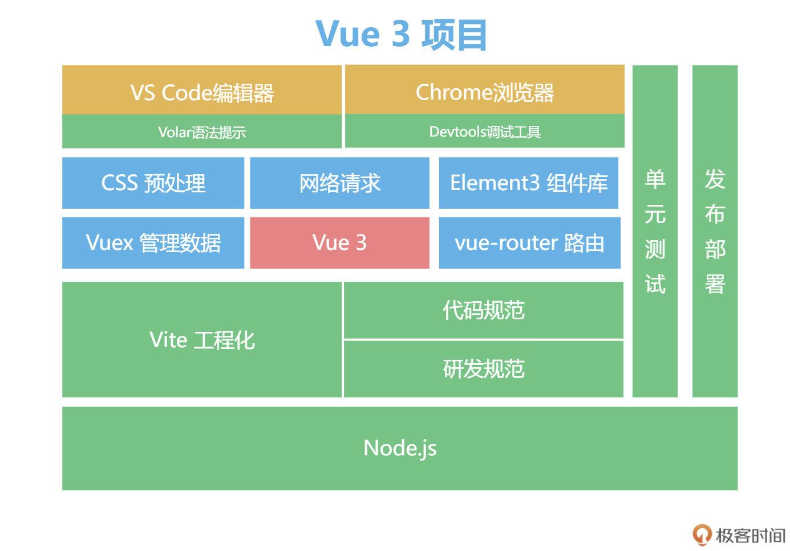

### 使用vite创建vue项目

创建参考[Vite官方中文文档](https://cn.vitejs.dev/guide/)

创建后的初始项目结构如下：

```
├── README.md
├── index.html           入口文件
├── package.json
├── public               资源文件
│   └── favicon.ico
├── src                  源码
│   ├── App.vue          单文件组件
│   ├── assets
│   │   └── logo.png
│   ├── components   
│   │   └── HelloWorld.vue
│   └── main.js          入口
└── vite.config.js vite工程化配置文件
```

现在，项目的架构是下图所示的这个样子，这样我们的项目就拥有了工程化的雏形。我们来从下往上看这个架构：**我们所有工程化体系都是基于 Node.js 生态；我们使用 VS Code+Volar 编辑器 + 语法提示工具作为上层开发工具；使用 Vite 作为工程化工具；使用 Chrome 进行调试**，这些都是 Vue 3 工程化体系的必备工具。


安装vuex和vue-router，项目架构就变成了如下所示：


当然这样还不够，我们在实际项目开发中还会有各种工具的集成，比如写 CSS 代码时，我们需要预处理工具 stylus 或者 sass；组件库开发中，我们需要 Element3 作为组件库；网络请求后端数据的时候，我们需要 Axios。

对于团队维护的项目，工具集成完毕后，还要有严格的代码规范。我们需要 Eslint 和 Prettier 来规范代码的格式，Eslint 和 Prettier 可以规范项目中 JavaScript 代码的可读性和一致性。

代码的管理还需要使用 Git，我们默认使用 GitHub 来托管我们的代码。此外，我们还会使用 commitizen 来规范 Git 的日志信息。

对于我们项目的基础组件，我们还会提供单元测试来确保代码质量和可维护性，最后我们还会配置 GitHub Action 来实现自动化的部署。




#### 规范

无规矩不成方圆，团队项目中的规范尤其重要。我们先对几个文件夹的分层进行规定，便于管理，下面是 src 目录的组织结构。

```
├── src
│   ├── api            数据请求
│   ├── assets         静态资源
│   ├── components     组件
│   ├── pages          页面
│   ├── router         路由配置
│   ├── store          vuex数据
│   └── utils          工具函数
```


#### Volar插件(vs code)

与`vetur`相同，`volar`是一个针对`vue`的`vscode`插件，不过与`vetur`不同的是，`volar`提供了更为强大的功能。

-  不再需要唯一根标签
- 编辑器快捷分割（将vue单文件分割成template、script、style三个视窗）
- style里面显示class的引用情况
- class追溯
- css module类型提示
- ...


#### Vue Devtools插件(chrome)

Chrome DevTools extension for debugging Vue.js applications.


#### vite官方收集的一些和vite相关的项目模板

地址：https://github.com/vitejs/awesome-vite

### 代码拆分

通过把功能拆分成函数和文件的方式，掌握到 Composition API 组织代码的方式，我们可以任意拆分组件的功能，抽离出独立的工具函数，大大提高了代码的可维护性。

```vue
<template>
  <div>
    <input type="text" v-model="title" @keydown.enter="addTodo" />
    <button v-if="active < all" @click="clear">清理</button>
    <ul v-if="todos.length">
      <li v-for="todo in todos">
        <input type="checkbox" v-model="todo.done" />
        <span :class="{ done: todo.done }"> {{ todo.title }}</span>
      </li>
    </ul>
    <div v-else>暂无数据</div>
    <div>
      全选<input type="checkbox" v-model="allDone" />
      <span> {{ active }} / {{ all }} </span>
    </div>
  </div>
</template>

<script setup>
import { ref,computed } from "vue";
let title = ref("");
let todos = ref([{title:'学习Vue',done:false}])

function addTodo() {
  todos.value.push({
    title: title.value,
    done: false,
  });
  title.value = "";
}
function clear() {
  todos.value = todos.value.filter((v) => !v.done);
}
let active = computed(() => {
  return todos.value.filter((v) => !v.done).length;
});
let all = computed(() => todos.value.length);
let allDone = computed({
  get: function () {
    return active.value === 0;
  },
  set: function (value) {
    todos.value.forEach((todo) => {
      todo.done = value;
    });
  },
});
</script>
```

将上面的vue文件拆分成两个文件：

```javascript
function useTodos() {
  let title = ref("");
  let todos = ref([{ title: "学习Vue", done: false }]);
  function addTodo() {
    todos.value.push({
      title: title.value,
      done: false,
    });
    title.value = "";
  }
  function clear() {
    todos.value = todos.value.filter((v) => !v.done);
  }
  let active = computed(() => {
    return todos.value.filter((v) => !v.done).length;
  });
  let all = computed(() => todos.value.length);
  let allDone = computed({
    get: function () {
      return active.value === 0;
    },
    set: function (value) {
      todos.value.forEach((todo) => {
        todo.done = value;
      });
    },
  });
  return { title, todos, addTodo, clear, active, all, allDone };
}
```

```vue
<script setup>
import { ref, computed } from "vue";

let count = ref(1)
function add(){
    count.value++
}

let { title, todos, addTodo, clear, active, all, allDone } = useTodos();
</script>
```


#### 封装一个useMouse()函数

```javascript
import {ref, onMounted,onUnmounted} from 'vue'

export function useMouse(){
    const x = ref(0)
    const y = ref(0)
    function update(e) {
      x.value = e.pageX
      y.value = e.pageY
    }
    onMounted(() => {
      window.addEventListener('mousemove', update)
    })
  
    onUnmounted(() => {
      window.removeEventListener('mousemove', update)
    })
    return { x, y }
}
```

```vue
import {useMouse} from '../utils/mouse'

let {x,y} = useMouse()
```

