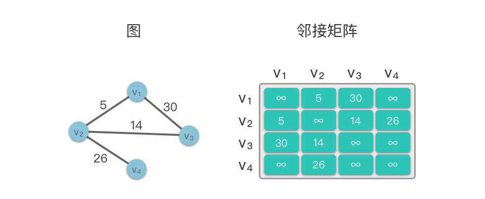
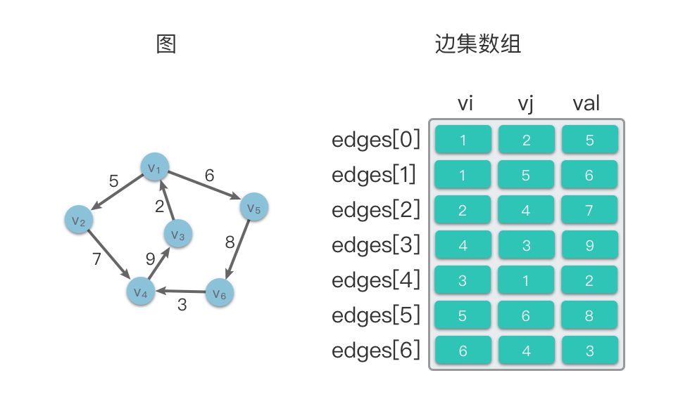
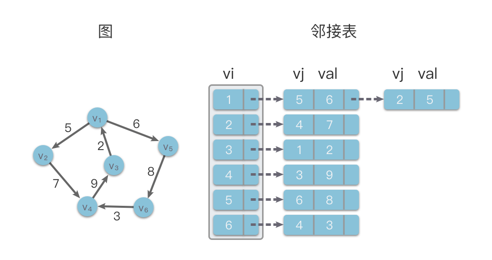

# 图的定义
> 由顶点的非空有限集合V（由 n > 0 个顶点组成）与边的集合E（顶点之间的关系）构成的结构。其形式化定义为 G=(V,E)

# 图的分类
- 有向图和无向图
- 有环图和无环图
- 连同图和非连通图
- 有权图
- 稠密图和稀疏图

# 图的存储结构
## 邻接矩阵
使用一个二维数组adj_matrix来存储顶点之间的邻接关系。
- 对于无权图来说，adj_matrix[i][j]为1，则表示节点i到节点j存在边，若为0，则表示节点i到节点j之间不存在边。
- 对于有权图来说，adj_matrix[i][j]为w（w不等于无穷大），则表示节点i到节点j之间存在权重为w的边，若为无穷大，则表示不存在边。

优缺点：
- 优点：实现简单，并且可以直接查询顶点v[i]与v[j]之间是否有边存在，还可以直接查询边的权值
- 缺点：初始化效率和遍历效率较低，空间开销大，空间利用率低，且不能存储重复边，也不便于增删节点。



## 边集数组
使用一个数组来存储存储顶点之间的邻接关系。数组中每个元素都包含一条边的起点i、终点j和边的权值val（如果是带权图）。



## 邻接表
使用顺序存储和链式存储相结合的存储结构来存储图的顶点和边。其数据结构包括两个部分，其中一个部分是数组，主要用来存放顶点的数据信息，另一个部分是链表，用来存放边信息。

在邻接表的存储方法中，对于对图中每个顶点i建立一个线性链表，把所有邻接于i的顶点链接到单链表上。这样对于具有n个顶点的图而言，其邻接表结构由 n 个线性链表组成。



邻接表的代码实现（实际代码实现与上图有所不同）：
- 为了方便添加与删除顶点，以及简化代码，我们使用列表（动态数组）来代替链表
- 使用哈希表来存储邻接表，key 为顶点实例，value 为该顶点的邻接顶点列表（链表）
```js
/* 基于邻接表实现的无向图类 */
class GraphAdjList {
    // 邻接表，key：顶点，value：该顶点的所有邻接顶点
    adjList;

    /**
     * @param {Array} edges 边集数组，例如：[[1, 2], [1, 3], [2, 4]]
     */
    constructor(edges) {
        this.adjList = new Map();
        // 添加所有顶点和边
        for (const edge of edges) {
            this.addVertex(edge[0]);
            this.addVertex(edge[1]);
            this.addEdge(edge[0], edge[1]);
        }
    }

    /* 获取顶点数量 */
    size() {
        return this.adjList.size;
    }

    /* 添加边 */
    addEdge(vet1, vet2) {
        if (
            !this.adjList.has(vet1) ||
            !this.adjList.has(vet2) ||
            vet1 === vet2
        ) {
            throw new Error('Illegal Argument Exception');
        }
        // 添加边 vet1 - vet2
        this.adjList.get(vet1).push(vet2);
        this.adjList.get(vet2).push(vet1);
    }

    /* 删除边 */
    removeEdge(vet1, vet2) {
        if (
            !this.adjList.has(vet1) ||
            !this.adjList.has(vet2) ||
            vet1 === vet2
        ) {
            throw new Error('Illegal Argument Exception');
        }
        // 删除边 vet1 - vet2
        this.adjList.get(vet1).splice(this.adjList.get(vet1).indexOf(vet2), 1);
        this.adjList.get(vet2).splice(this.adjList.get(vet2).indexOf(vet1), 1);
    }

    /* 添加顶点 */
    addVertex(vet) {
        if (this.adjList.has(vet)) return;
        // 在邻接表中添加一个新链表
        this.adjList.set(vet, []);
    }

    /* 删除顶点 */
    removeVertex(vet) {
        if (!this.adjList.has(vet)) {
            throw new Error('Illegal Argument Exception');
        }
        // 在邻接表中删除顶点 vet 对应的链表
        this.adjList.delete(vet);
        // 遍历其他顶点的链表，删除所有包含 vet 的边
        for (const set of this.adjList.values()) {
            const index = set.indexOf(vet);
            if (index > -1) {
                set.splice(index, 1);
            }
        }
    }

    /* 打印邻接表 */
    print() {
        console.log('邻接表 =');
        for (const [key, value] of this.adjList) {
            const tmp = [];
            for (const vertex of value) {
                tmp.push(vertex.val);
            }
            console.log(key.val + ': ' + tmp.join());
        }
    }
}
```

# 图的遍历
## 深度优先遍历
> 深度优先遍历是一种优先走到底、无路可走再回头的遍历方式。

### 算法实现
这种“走到尽头再返回”的算法范式通常基于递归来实现。  

步骤：
1. 选择起始节点u，并将其标记为已访问
2. 检查当前节点是否为目标节点
3. 若当前节点是目标节点，则直接返回结果
4. 如果当前节点不是目标节点，则遍历节点u的所有未访问邻接节点
5. 对每个未访问的节点v，从节点v出发继续进行深度优先搜索（递归）
6. 如果节点u没有未访问的节点，则回溯到上一个节点，继续搜索其他路径
7. 重复2~6步骤，直到遍历完整个图或找到目标节点为止
```js
// 使用邻接表来表示图，以便获取指定顶点的所有邻接顶点
function dfs(graph, visited, res, vet) {
    res.push(vet);
    visited.add(vet);
    
    for (const adjVet of graph.adjList.get(vet)) {
        if (visited.has(adjVet))
            continue;
        // 递归访问邻接顶点
        dfs(graph, visited, res, adjVet);
    }
}


function graphDFS(graph, startVet) {
    // 顶点遍历序列
    const res = [];
    // 哈希集合，用于记录已被访问过的顶点
    const visited = new Set();
    dfs(graph, visited, res, startVet);
    return res;
}
```

## 广度优先遍历
> 广度优先遍历是一种由近及远的遍历方式，从某个节点出发，始终优先访问距离最近的顶点，并一层层向外扩张。

### 算法实现
BFS 通常借助队列来实现

步骤：
1. 将起始节点u放入队列中，并标记为已访问
2. 从队列中取出一个节点，访问它并将其所有未访问的邻接节点v放入队列中
3. 标记已访问的节点v，以避免重复访问
4. 重复2~3步骤，直到队列为空或者找到目标节点为止

```js
// 使用邻接表来表示图，以便获取指定顶点的所有邻接顶点
function graphBFS(graph, startVet) {
    // 顶点遍历序列
    const res = [];
    // 哈希集合，用于记录已被访问过的顶点
    const visited = new Set();
    visited.add(startVet);
    
    const queue = [startVet];
    while (queue.length) {
        const vet = queue.shift();
        res.push(vet);
        // 遍历该顶点的所有邻接顶点
        for (const adjVet of graph.adjList.get(vet) ?? []) {
            if (visited.has(adjVet))
                continue;
            
            queue.push(adjVet);
            visited.add(adjVet);
        }
    }
    
    return res;
}
```

## 拓扑排序
一种对有向无环图（DAG）的所有顶点进行线性排序的方法，使得图中任意一点 u 和 v，如果存在有向边 <u,v>，则 u 必须在 v 之前出现。对有向图进行拓扑排序产生的线性序列称为满足拓扑次序的序列，简称拓扑排序。

图的拓扑排序是针对有向无环图（DAG）来说的，无向图和有向有环图没有拓扑排序，或者说不存在拓扑排序。

对于一个有向无环图来说，拓扑序列可能不止一个。

实现拓扑排序的方法有两种：
- Kahn 算法（先找起始点，即入度为0的节点）
- 基于DFS的拓扑排序算法

### Kahn算法
1. 不断找寻有向图中入度为 0 的顶点，将其输出。
2. 然后删除入度为 0 的顶点和从该顶点出发的有向边。
3. 重复上述操作直到图为空，或者找不到入度为 0 的节点为止。
```js
// edges表示边集数组
function topoKahn(edges) {
    let vets = new Set()
    let adj = {}
    let indegrees = {}
    
    edges.forEach(edge => {
        // 记录顶点信息
        vets.add(edge[0])
        vets.add(edge[1])

        // 构建邻接表
        if (!adj[edge[0]]) {
            adj[edge[0]] = []
        }

        if (!adj[edge[1]]) {
            adj[edge[1]] = []
        }

        adj[edge[0]].push(edge[1])

        // 统计入度
        if (indegrees[edge[1]] === undefined)
            indegrees[edge[1]] = 0

        indegrees[edge[1]]++
    });

    let vetsArr = Array.from(vets)
    
    let res = []
    const zeroStack = []

    vetsArr.forEach(vet => {
        if (!indegrees[vet]) {
            zeroStack.push(vet)
        }
    })

    while(zeroStack.length > 0) {
        let vet = zeroStack.pop()
        res.push(vet)

        for (const v of adj[vet]) {
            indegrees[v]--
            if (indegrees[v] === 0)
                zeroStack.push(v)
        }
    }

    if (res.length !== vetsArr.length)
        return '-1'

    
    return res.join(' ');
}

console.log(topoKahn([[0, 1], [0, 2], [1, 2], [2, 3]]))
console.log(topoKahn([[0, 1], [0, 2], [1, 2], [2, 3], [3, 1]]))
```

### 基于DFS的拓扑排序算法 
基于 DFS 实现拓扑排序算法的基本思想：
1. 对于一个顶点 u，深度优先遍历从该顶点出发的有向边 <u,v>。如果从该顶点 u 出发的所有相邻顶点 v 都已经搜索完毕，则回溯到顶点 u 时，该顶点 u 应该位于其所有相邻顶点 v 的前面（拓扑序列中）。
2. 这样一来，当我们对每个顶点进行深度优先搜索，在回溯到该顶点时将其放入栈中，则最终从栈顶到栈底的序列就是一种拓扑排序
```js
// edges表示边集数组
function topoDFS(edges) {
    let vets = new Set()
    let adj = {}
    
    edges.forEach(edge => {
        // 记录顶点信息
        vets.add(edge[0])
        vets.add(edge[1])

        // 构建邻接表
        if (!adj[edge[0]]) {
            adj[edge[0]] = []
        }

        adj[edge[0]].push(edge[1])
    });

    let vetsArr = Array.from(vets)
    
    const stack = []
    // 集合 visited 用于记录当前顶点是否被访问过，避免重复访问
    const visited = new Set()
    // onStack 用于记录同一次深度优先搜索时，当前顶点是否被访问过。如果当前顶点被访问过，则说明图中存在环路，无法构成拓扑序列。
    const onStack = new Set()
    let hasCycle = false

    function dfs(vet) {
        if (onStack.has(vet))
            hasCycle = true

        if (onStack.has(vet) || visited.has(vet))
            return

        onStack.add(vet)

        // dfs递归调用
        if (adj[vet] && adj[vet].length > 0) {
            for (const v of adj[vet]) {
                dfs(v)
            }
        }

        onStack.delete(vet)

        stack.push(vet)
        visited.add(vet)
    }
    
    
    dfs(vetsArr[0]);

    if (hasCycle)
        return '-1'

    let res = []
    while(stack.length > 0) {
        res.push(stack.pop())
    }

    return res.join(' ');
}

console.log(topoDFS([[0, 1], [0, 2], [1, 2], [2, 3]]))
console.log(topoDFS([[0, 1], [0, 2], [1, 2], [2, 3], [3, 1]]))
```

### 题目：华为OD算法——查找一个有向网络的头节点和尾节点
> 给定一个有向图，图中可能包含有环，图使用二维矩阵表示，每一行的第一列表示起始节点，第二列表示终止节点，如 [0, 1] 表示从 0 到 1 的路径。  
每个节点用正整数表示。求这个数据的首节点与尾节点，题目给的用例会是一个首节点，但可能存在多个尾节点。同时图中可能含有环。如果图中含有环，返回 [-1]。  
说明：入度为0是首节点，出度为0是尾节点。  
>
> 输入描述：  
第一行为后续输入的键值对数量N（N ≥ 0）  
第二行为2N个数字。每两个为一个起点，一个终点.  
>
> 输出描述：  
输出一行头节点和尾节点。如果有多个尾节点，按从小到大的顺序输出

题解思路（基于Kahn算法）：
1. 使用邻接表表示有向图，并记录入度出度
2. 从入度为0的点开始删除，如上图显然是1的入度为0，先删除。
3. 判断有无环的方法，对入度数组遍历，如果有的点入度不为0，则表明有环

```js
/**
 * 
 * @param {Number} n 边的数量
 * @param {String} adjStr 边的键值对，每两个数字一对
 */
function findEnd(n, adjStr) {
    let arr = adjStr.split(' ').map(Number)
    let adj = {}
    let inCount = {}
    let outCount = {}

    for (let i = 0; i < arr.length - 1; i++) {
        let src = arr[i]
        let dst = arr[i + 1]
        i++
        // 构建邻接表
        if (!adj[src]) {
            adj[src] = []
        }
        if (!adj[dst]) {
            adj[dst] = []
        }

        adj[src].push(dst)

        // 统计入度
        if (inCount[src] === undefined) {
            inCount[src] = 0
        }
        if (inCount[dst] === undefined) {
            inCount[dst] = 0
        }

        inCount[dst] += 1

        // 统计出度
        if (outCount[src] === undefined) {
            outCount[src] = 0
        }
        if (outCount[dst] === undefined) {
            outCount[dst] = 0
        }

        outCount[src] += 1
    }

    // 入度为0的加入起点数组，出度为0的加入终点数组
    let beginArr = []
    let endArr = []
    Object.keys(inCount).forEach(key => {
        if (inCount[key] === 0) {
            beginArr.push(key)
        }
        if (outCount[key] === 0) {
            endArr.push(key)
        }
    })

    beginArr.sort()
    endArr.sort()
    let res = [...beginArr, ...endArr]

    // 通过Kahn算法判断是否有环
    let topoArr = []
    let zeroStack = [...beginArr]

    while(zeroStack.length > 0) {
        let vet = zeroStack.pop()
        topoArr.push(vet)

        for(const v of adj[vet]) {
            inCount[v]--
            if (inCount[v] === 0) {
                zeroStack.push(v)
            }
        }
    }

    if (topoArr.length !== Object.keys(inCount).length)
        return '-1'

    return res.join(' ')
}

console.log(findEnd(4, '0 1 0 2 1 2 2 3'))
console.log(findEnd(2, '0 1 0 2'))
console.log(findEnd(5, '0 1 0 2 1 2 2 3 3 1'))
```