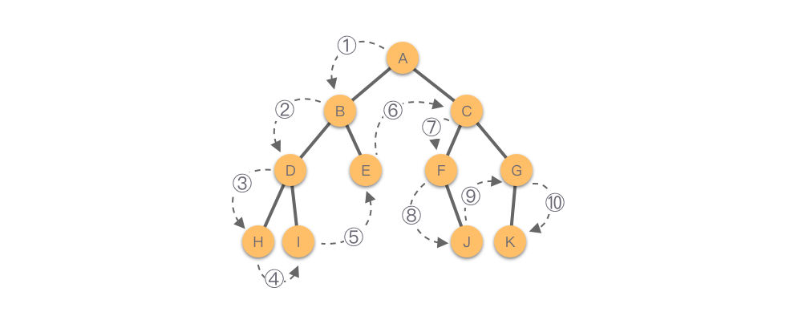
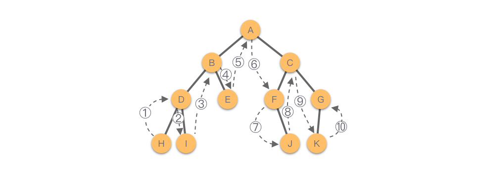
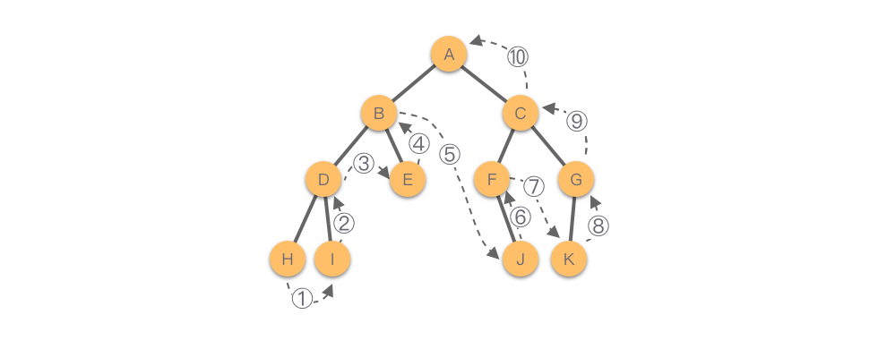
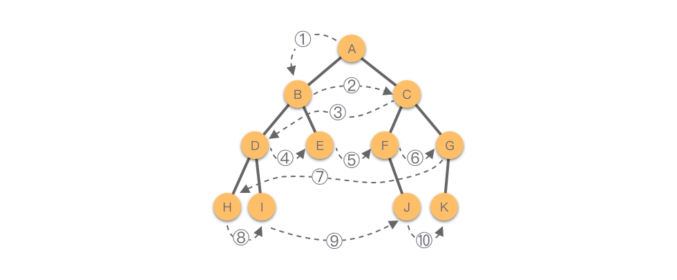

# 二叉树
> 二叉树（Binary Tree）：树中各个节点的度不大于2个的有序树，称为二叉树。

## 二叉树分类
- 满二叉树：如果所有分支节点都存在左子树和右子树，并且所有叶子节点都在同一层上，则称该二叉树为满二叉树。
- 完全二叉树：如果叶子节点只能出现在最下面两层，并且最下层的叶子节点都依次排列在该层最左边的位置上，具有这种特点的二叉树称为完全二叉树。
- 平衡二叉树：任意节点的左子树和右子树的高度之差的绝对值不超过1

## 二叉树存储结构
### 顺序存储结构
二叉树的顺序存储结构使用一维数组来存储二叉树中的节点，**节点存储位置则采用完全二叉树的节点层次编号**，按照层次从上至下，每一层从左至右的顺序依次存放二叉树的数据元素。在进行顺序存储时，如果对应的二叉树节点不存在，则设置为「空节点」

堆排序、优先队列中的二叉堆结构，采用的就是二叉树的顺序存储结构

>- 如果某二叉树节点（非叶子节点）的下标为 i，那么其左孩子节点下标为 `2∗i+1`，右孩子节点下标为 `2∗i+2`。
>- 如果某二叉树节点（非根节点）的下标为 i，那么其根节点下标为 `(i−1)//2`。`//` 表示整除。

### 链式存储结构
二叉树采用链式存储结构时，每个链节点包含一个用于数据域 val，存储节点信息；还包含两个指针域 left 和 right，分别指向左右两个孩子节点，当左孩子或者右孩子不存在时，相应指针域值为空。

### 顺序存储结构转链式存储结构
```js
class TreeNode {
    constructor(val) {
        this.val = val;
        this.left = this.right = null;
    }
}

function arrayToBinaryTree(arr) {
    if (!arr || arr.length === 0) return null;

    // 递归辅助函数，用于根据数组索引构建二叉树
    function buildTree(arr, index) {
        if (index >= arr.length || index < 0 || arr[index] === null)
            return null;

        const node = new TreeNode(arr[index]);
        node.left = buildTree(arr, 2 * index + 1); // 左子节点在 2*index + 1
        node.right = buildTree(arr, 2 * index + 2); // 右子节点在 2*index + 2
        return node;
    }

    return buildTree(arr, 0);
}

console.log(arrayToBinaryTree([1, null, 2, null, null, 3]))
```

## 二叉树的遍历
> 根据个人理解，前、中、后序指的是根节点相对于左右子节点的访问顺序

### 前序遍历（递归|显式栈）
二叉树的前序遍历规则为：
- 如果二叉树为空，则返回。
- 如果二叉树不为空，则：
  1. 访问根节点。
  2. 以前序遍历的方式遍历根节点的左子树。
  3. 以前序遍历的方式遍历根节点的右子树。

如下图，二叉树的前序遍历顺序为：A−B−D−H−I−E−C−F−J−G−K


### 中序遍历（递归|显式栈）
二叉树的中序遍历规则为：
- 如果二叉树为空，则返回。
- 如果二叉树不为空，则：
  1. 以中序遍历的方式遍历根节点的左子树。
  2. 访问根节点。
  3. 以中序遍历的方式遍历根节点的右子树。

如下图，二叉树的中序遍历顺序为：H−D−I−B−E−A−F−J−C−K−G


### 后序遍历（递归|显式栈）
二叉树的后序遍历规则为：
- 如果二叉树为空，则返回。
- 如果二叉树不为空，则：
  1. 以后序遍历的方式遍历根节点的左子树。
  2. 以后序遍历的方式遍历根节点的右子树。
  3. 访问根节点。

如下图，二叉树的后序遍历顺序为：H−I−D−E−B−J−F−K−G−C−A


### 层序遍历（队列+循环）
二叉树的层序遍历规则为：
- 如果二叉树为空，则返回。
- 如果二叉树不为空，则：
  1. 先依次访问二叉树第1层的节点。
  2. 然后依次访问二叉树第2层的节点。
  3. ......
  4. 依次下去，最后依次访问二叉树最下面一层的节点。

二叉树的后序遍历顺序为：A−B−C−D−E−F−G−H−I−J−K


## 考察二叉树遍历的题目
### LeetCode：二叉树的前序遍历
给你二叉树的根节点 root ，返回它节点值的 前序 遍历。  
用例：  
输入：root = [1,null,2,3]  
输出：[1,2,3]

代码：  
```js
// 递归版本
class TreeNode {
    constructor(val) {
        this.val = val;
        this.left = this.right = null;
    }
}

/**
 * @param {TreeNode} root
 * @return {number[]}
 */
var preorderTraversal = function(root, res = []) {
    if (!root) return res;
    // 前、中、后序遍历只是以下三行代码的顺序变化
    res.push(root.val);
    preorderTraversal(root.left, res)
    preorderTraversal(root.right, res)
    return res;
}
```

```js
// 显式栈版本（迭代）
var preorderTraversal = function(root, res = []) {
    if(!root) return res;
    const stack = [root];
    let cur = null;
    while(stack.length) {
        cur = stack.pop();
        res.push(cur.val);
        cur.right && stack.push(cur.right);
        cur.left && stack.push(cur.left);
    }
    return res;
};
```

### 华为OD算法题：二叉树的广度优先遍历
有一棵二叉树，每个节点由一个大写字母标识（最多26个节点）。  
现有两组字母，分别表示后序遍历（左孩子->右孩子->父节点）和中序遍历（左孩子->父节点->右孩子）的结果，请你输出层序遍历的结果。
根据后序遍历和中序遍历的结果输出层序遍历的结果  
用例：  
输入：CBEFDA CBAEDF  
输出：ABDCEF

解析：  
1. 首先，我们可以根据后序遍历，快速找到树根，即 CBEFDA 中的 A，因为根据左右根遍历顺序，最后一个遍历元素肯定是这颗树的根节点
2. 找到根节点 A 后，我们又可以在中序遍历的左根右遍历顺序，找到 A 根的左、右子树，即中序遍历中 A 节点的左边就是 A 根的左子树，右边就是 A 根的右子树
3. 找到左右子树后，我们可以根据后序遍历，再分别找到左、右子树的根，然后再根据中序遍历结果，再找出左子树根的左右子树，以及右子树的左右子树（即针对子树重复1、2步骤）

代码：  
```js
function bfsTree(post, mid) {
    let queue = [], result = ''
    queue.push([post, mid])

    while(queue.length > 0) {
        let [curPost, curMid] = queue.shift()

        let root = curPost[curPost.length - 1]
        let rootIndex = curMid.indexOf(root)
        let leftLen = rootIndex
        result += root

        if (rootIndex > 0) {
            let leftMid = curMid.slice(0, rootIndex)
            let leftPost = curPost.slice(0, leftLen)
            queue.push([leftPost, leftMid])
        }
        
        if (rootIndex + 1 < curMid.length) {
            let rightMid = curMid.slice(rootIndex + 1)
            let rightPost = curPost.slice(leftLen, leftLen + rightMid.length)
            queue.push([rightPost, rightMid])
        }
    }
    console.log(result)
    return result
}

bfsTree('CBEFDA', 'CBAEDF') // ABDCEF
```

# 二叉搜索树
二叉搜索树（Binary Search Tree）：也叫做二叉查找树、有序二叉树或者排序二叉树。是指一棵空树或者具有下列性质的二叉树：
- 如果任意节点的左子树不为空，则左子树上所有节点的值均小于它的根节点的值。
- 如果任意节点的右子树不为空，则右子树上所有节点的值均大于它的根节点的值。
- 任意节点的左子树、右子树均为二叉搜索树。

## 题目
### 华为OD算法：二维伞的雨滴效应
问题等价于：[从前序遍历的结果中重建二叉搜索树](https://liam.page/2019/08/29/rebuild-a-binary-search-tree-from-its-preorder-traversal-result/)

#### 方法一
首先要考虑，一个无重复元素的二叉搜索树的前序遍历结果能否唯一确定一个二叉搜索树？答案是可以的，简要证明如下：
- 已知二叉搜索树的前序遍历结果，即知晓二叉搜索树中所有元素；
- 对二叉搜索树中所有元素进行从小到大排序，根据二叉搜索树的性质，即得到该二叉搜索树的中序遍历结果；
- 已知二叉树的前序遍历结果和中序遍历结果，可以唯一地确定一个二叉树，即该二叉搜索树。

由此可知，一个无重复元素的二叉搜索树的前序遍历结果，确实能够唯一地确定一个二叉搜索树。该方法时间复杂度为O(nlog(n))
```js
// 此解法类似于前面的“二叉树的广度优先遍历”，代码省略
```

#### 方法二
前面实现中序遍历的目的是为了得到左右子树。在前序遍历中，左子树的根节点的位置是平凡的——如果存在左子树，左子树根节点就是整棵树根节点的在前序遍历中的下一个元素。所以关键是要想办法确定右子树（如果有）根节点的位置。

好消息是，我们现在需要重建的二叉树是二叉搜索树。因此，树根的右孩子，就是前序遍历中第一个比根节点大的那个元素。这样一来，我们就能确定根节点的左右孩子的位置了，如此一来，只需要递归就能解决问题。

于是，遗留的问题变成了：**如何在常数时间内找到第一个比根节点大的元素的位置**。时间复杂度O(n)

方法二递归算法：
```js
class TreeNode{
    constructor( val){
        this.val = val;
    }
 
}
let index = 0
function rebuildBST(arr, bound = Infinity) {
    if (index === arr.length || arr[index] > bound)
        return null

    let node = new TreeNode(arr[index])
    ++index
    node.left = rebuildBST(arr, node.val)
    node.right = rebuildBST(arr, bound)
    console.log(node)
    return node
}

rebuildBST([8, 3, 1 ,6, 4, 7, 10 ,14, 13])
```

方法二非递归算法：  
若要非递归地实现这一算法，我们需要：
- 用某种方式，重新引入哨兵 `std::numeric_limits<int>::max()；`
- 循环，从 0 -> preorder.size()；
- 提供一个栈，直接或间接地保存这里的 bound
```js
class TreeNode{
    constructor( val){
        this.val = val;
    }
 
}
 
function rebuildBST(nums){
    let root = new TreeNode(Infinity)
    let stack = []
    stack.push(root)

    for (let i = 0; i < nums.length; i++) {
        let val = nums[i]
        let node = new TreeNode(val)
        let wk = null

        // 每一次弹栈，都意味着遇到了右孩子
        while (stack.length > 0 && stack[stack.length - 1].val < val) {
            wk = stack.pop()
        }

        if (wk === null) {
            stack[stack.length - 1].left = node
        } else {
            wk.right = node
        }

        stack.push(node)
    }

    let res = root.left
    root.right = null
    delete root
    console.log(res)

    return res
}
 
rebuildBST([8, 3, 1 ,6, 4, 7, 10 ,14, 13])
```